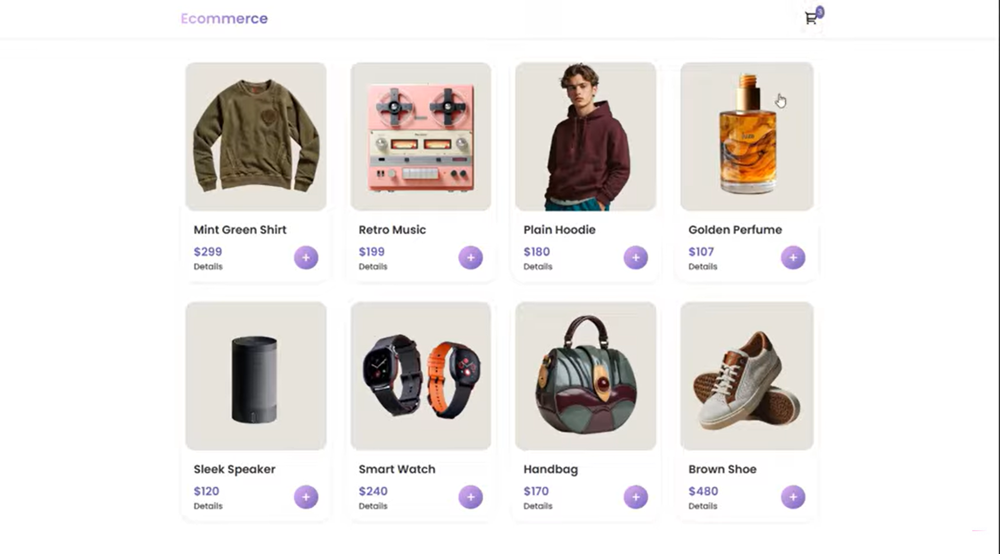

# Basic E-commerce Store

A lightweight, responsive e-commerce website built with vanilla JavaScript, HTML, and CSS. This project demonstrates core e-commerce functionality including product browsing, shopping cart management, and product details view.

## Demo



## Features

- **Product Grid Display**: Responsive grid layout showcasing 8 sample products
- **Shopping Cart**: 
  - Add products to cart with quantity tracking
  - Increment/decrement item quantities
  - Real-time cart total calculation
  - Cart badge showing total items
  - Clear cart functionality
- **Product Details Modal**: Click on product images or "View" button to see detailed product information
- **Responsive Design**: Mobile-friendly layout that adapts to different screen sizes
- **Modal Overlays**: Clean drawer-style interfaces for cart and product details
- **Indian Rupee (₹) Currency**: Prices displayed in INR format

## Technologies Used

- **HTML5**: Semantic markup structure
- **CSS3**: Custom styling with CSS Grid and Flexbox
- **Vanilla JavaScript**: No frameworks or libraries required
- **RemixIcon**: Icon library for cart and UI elements

## Project Structure

```
Basic_e-commerce/
│
├── index.html          # Main HTML file
├── js/
│   └── main.js         # JavaScript logic for products, cart, and interactions
├── styles/
│   └── styles.css      # CSS styling and responsive design
└── images/             # Product images directory
```

## Getting Started

### Prerequisites

- A modern web browser (Chrome, Firefox, Safari, Edge)
- No build tools or dependencies required

### Installation

1. Clone or download this repository
2. Add your product images to the `images/` folder
3. Open `index.html` in your web browser

### Running the Project

Simply open the `index.html` file in your browser:

```bash
# On Windows
start index.html

# On Mac
open index.html

# Or use a local server (recommended)
# Using Python 3
python -m http.server 8000

# Using Node.js http-server
npx http-server
```

Then navigate to `http://localhost:8000` in your browser.


```
## Demo

![E-commerce Store Demo]
(./images/Demo.png)

